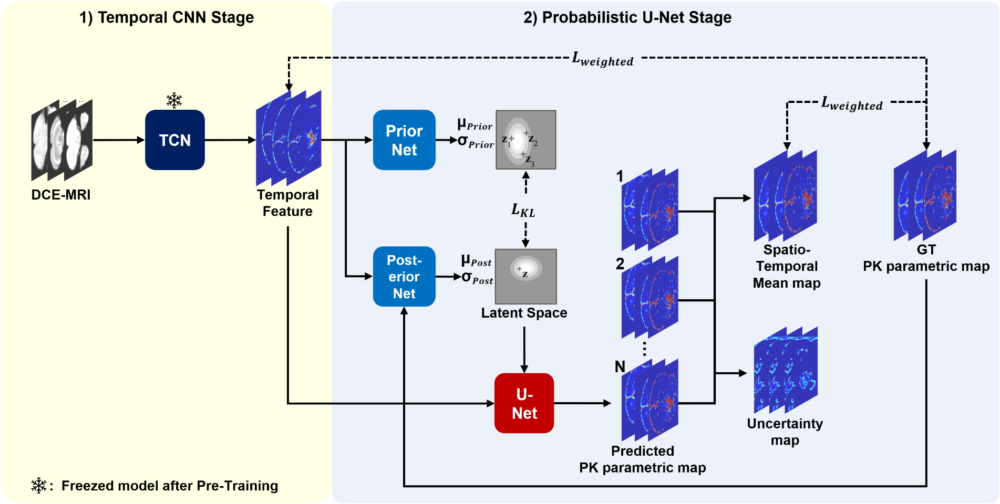
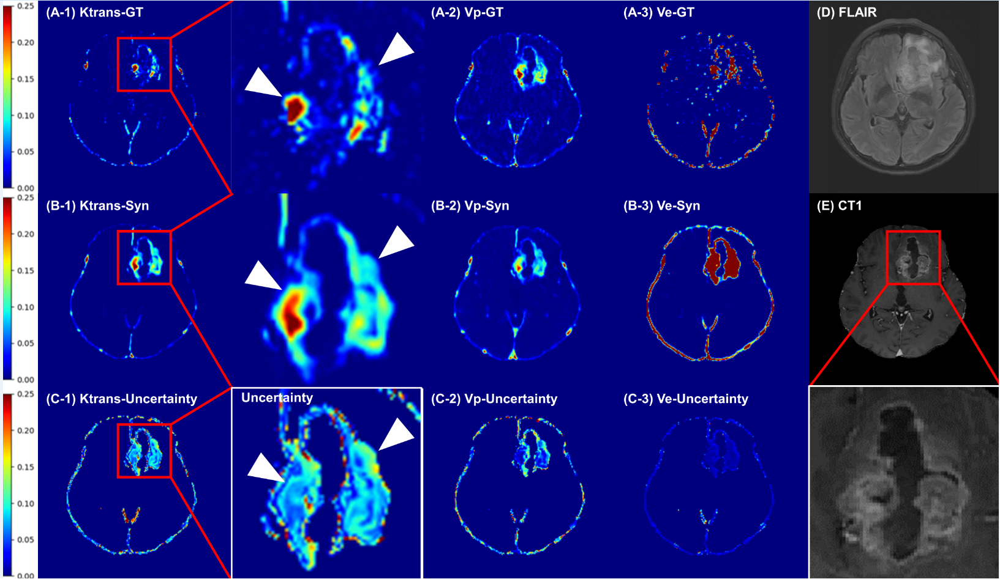

# dce2ktrans
This is an official code for "Deep Learning Enhances the Reliability of Dynamic Contrast-Enhanced MRI in Diffuse Gliomas: Bypassing Post-processing and Providing Uncertainty Maps"

## Summary
A spatiotemporal deep learning model can improve the reliability of DCE-MRI by bypassing the estimation of the AIF and providing uncertainty maps, without diagnostic performance in diffuse glioma grading.

## Model's Architecture

1. Designed a Deterministic Temporal CNN model (1st stage) to extract physical information variations along the temporal axis.

2. Developed a Probabilistic model (2nd stage) for the spatial axis to generate mean maps and uncertainty maps for image transformation.

3. Achieved high-accuracy PK parametric map transformation and provided uncertainty maps to assist radiologists in cancer diagnosis.

## Training
1) Training 3 Channel Outputs of TCN
- `python train_tcn_3ch_fusedlabel.py`

2) Training Probabilistic U-Net model
- `python `

To be updated

## Inference
1) Synthesize 3 channel outputs of TCN (same code with train. inference right after train.)
- `python train_tcn_3ch_fusedlabel.py`

2) Synthesize Probabilistic Samples from outputs of TCN
- `python inference_tcn_prob_unet_sample.py`

3) Synthesize Mean, Uncertainty map
- `python inference_mean_uncertainty.py`

## Dataset
The dataset was temporally split so that the test set (102 patients) consisted of scans taken after March 2016. The remaining 219 patients were randomly split into the training set (165 patients) and the validation set (62 patients).

### Data Processing
- **Conversion**: All DICOM files converted to NIfTI gzipped files.
- **Corrections**: Motion and N4 bias field corrected.
- **DCE Image**: Time-averaged DCE image skull stripped and resampled to 256x256 resolution in the xy-plane.
- **Tumor Segmentation**: 
  - T1WI, T2WI, FLAIR images skull stripped using BET package.
  - Images centered, re-oriented (RAS+), and resampled to 1mm isotropic voxels.
  - T2WI and FLAIR images registered to T1WI space using ANTs SyN algorithm.
  - HD-GLIO neural network used for tumor segmentation.
  - Tumor segmentation maps registered to DCE space using rigid affine transform from ANTs package.
